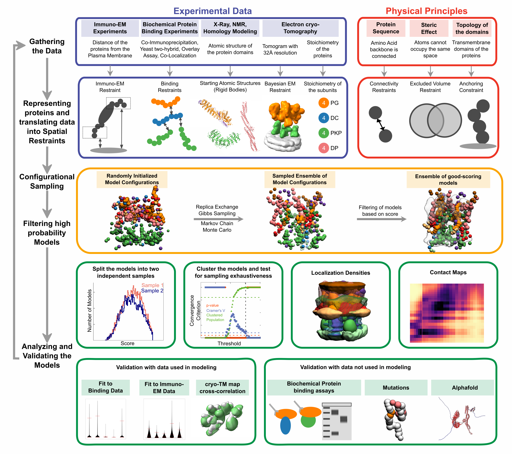

# Integrative structure of the desmosome outer dense plaque  

This repository is of the integrative model of the desmosome ODP based on data from X-ray crystallography, electron cryo-tomography, immuno-electron microscopy, yeast two-hybrid experiments, co-immunoprecipitation, in vitro overlay, in vivo co-localization assays, in-silico sequence-based predictions of transmembrane and disordered regions, homology modeling, and stereochemistry information. It contains input data, scripts for modeling and results including bead models and localization probability density maps. 
The modeling was performed using IMP (Integrative Modeling Platform).

Citation: [Pasani S, Menon KS, Viswanath S (2023). The molecular architecture of the desmosomal outer dense plaque by integrative structural modeling](link_to_the_paper)

## Layout
There are 3 main folders:  `input`, `scripts`, `results`. There is an explanation README for the folder-specific contents in each of the folders ([input](https://github.com/isblab/desmosome/blob/main/input/README.md), [scripts](https://github.com/isblab/desmosome/blob/main/scripts/README.md), [results](https://github.com/isblab/desmosome/blob/main/results/README.md)) and the general protocol is explained below. 
Additional data is uploaded in [Zenodo](link) (the set of major cluster models corresponding to the main modeling run presented in the paper).

## Protocol Summary
The below description applies to the main run (epithelial ODP) as well as two auxillary runs (epithelial ODP with PKP3, basal ODP). For preprocessing of the data (homology modeling, GMM generation, etc) see [inputs README](https://github.com/isblab/desmosome/blob/main/input/README.md).

### Sampling
This step involves employing MCMC sampling to generate the IMP models of ODP based in input information. The steps are:
1. Compile IMP with the custom Desmosome module (`scripts/modeling/custom_IMP_module`). See the instructions for compilation in the [official guide](https://integrativemodeling.org/nightly/doc/manual/installation.html)
2. The next step requires the data to be present in the working directory. Simply create a `data` directory containing all the `FASTA` and `PDB` files as well as the `GMM` text files and the original `.mrc` files in a subdirectory `data/gmm`. (see [scripts README](https://github.com/isblab/desmosome/blob/main/scripts/README.md) for details on this setup).
3. To run the sampling of each of the three aforementioned ODPs, run `scripts/modeling/main_run/all_run.sh` (or `other_runs/{specific_run}/all_run.sh`) which uses GNU Parallel to run the corresponding `server_run.sh` across a set of servers listed as a server list. For a single server run, a possible commands is `seq 0 44 | parallel '{path_to_script}/server_run.sh {}'`. 
4. The output is generated in separate folders named `output{number}` which are all collected for the next steps (in a multi-server setting).

### Analysis
This step involves getting the good scoring models, running [Sampcon](https://github.com/salilab/imp-sampcon) (sampling exhaustiveness), and analyzing the major clusters (generate contact maps, plots etc). These are accomplished by the following steps:
1. Collect all the `output{number}` folders generated above in a single directory
2. Create `analysis_output` directory
2. Run `scripts/analysis/main_run/extract_all.sh` (or the corresponding script for the other runs). Ensure that the paths used in the script (for example, the path to the IMP-installation setup script) are correct.
3. All the output is generated in `analysis_output` directory.

## Alphafold results 
Finally, we also run [Alphafold2-Multimer](https://github.com/deepmind/alphafold) and subsequent analysis. The input of AF2-Multimer is available in `scripts/analysis/alphafold/{specific_protein_pair}`. The output (best performing `ranked_0.pdb` and the corresponding `.pkl` file based on the order in `ranking_debug.json`) of AF2-Multimer is stored in individual directories specific to each protein pair after which the script `scripts/analysis/alphafold/alphafold_analysis.py` is run as `python alphafold_analysis.py {path_to_a_prot-pair_specific_folder} {output_path} {prot-pair_identifier}`. See [scripts README](https://github.com/isblab/desmosome/blob/main/scripts/README.md) for further details. 

6. Also note that the shell script deletes all the `output{number}` directories after running a few steps to minimize space requirements. **Backup the data elsewhere before running.**

## Versions and Requirements
All of the modeling and analysis was done in a multi-server setup with Linux Fedora using Bash scripts. Pre-processing (homology modeling, tomogram processing) was done in Windows 10. The python libraries (and their versions) used in the project are as follows:
1. matplotlib (3.6.2)
2. numpy (1.21.5)
3. scipy (1.9.3)
4. IMP (2.17)
5. mrcfile (1.4.3)
6. tqdm (4.62.0)
7. biopython (1.79)

Additional Linux software needed to run all the scripts in the repository:
1. [GNU Parallel](https://doi.org/10.5281/zenodo.3956817)
2. OpenMPI

### Information
**Author(s):** Satwik Pasani, Kavya S Menon, Shruthi Viswanath\
**Date**: June 12th, 2023\
**License:** [CC BY-SA 4.0](https://creativecommons.org/licenses/by-sa/4.0/)
This work is licensed under the Creative Commons Attribution-ShareAlike 4.0
International License.\
**Last known good IMP version:**  \
**Testable:** Yes\
**Parallelizeable:** Yes\
**Publications:**  TBD. DOI: [TBD](TBD).
